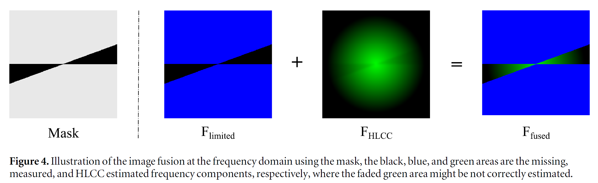
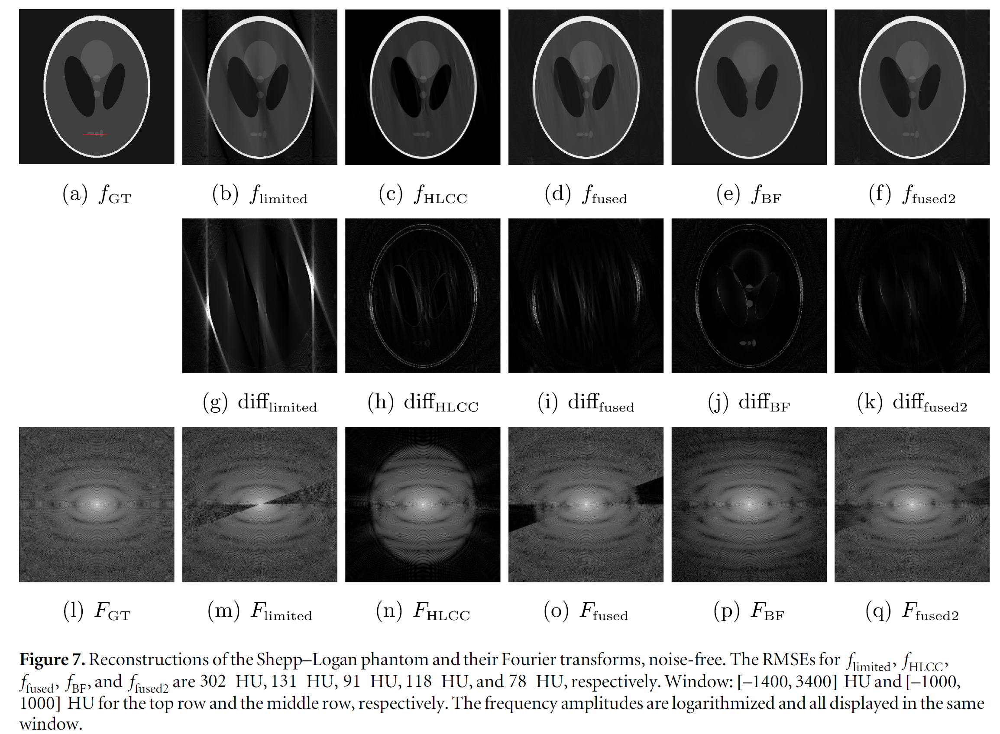
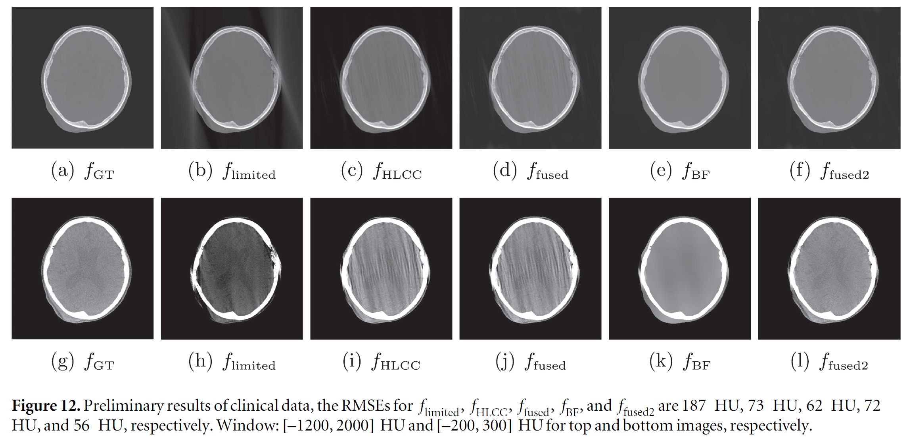

# Helgason-Ludwig-consistency-conditions
## Restoration of missing data in limited angle tomography based on Helgason–Ludwig consistency conditions
This is the official Java code for our implementation of "Restoration of missing data in limited angle tomography based on Helgason–Ludwig consistency conditions" paper.


## Citation
[1] Huang Y, Huang X, Taubmann O, Xia Y, Haase V, Hornegger J, Lauritsch G, Maier A. Restoration of missing data in limited angle tomography based on Helgason–Ludwig consistency conditions. Biomedical Physics & Engineering Express. 2017 May 25;3(3):035015.

Bibtex:
```
@article{huang2017restoration,
  title={Restoration of missing data in limited angle tomography based on Helgason--Ludwig consistency conditions},
  author={Huang, Yixing and Huang, Xiaolin and Taubmann, Oliver and Xia, Yan and Haase, Viktor and Hornegger, Joachim and Lauritsch, Guenter and Maier, Andreas},
  journal={Biomedical Physics \& Engineering Express},
  volume={3},
  number={3},
  pages={035015},
  year={2017},
  publisher={IOP Publishing}
}
```

## Presentation
One presentation to explain the details is [here](Slides_HLCC in Limited Angle Reconstruction.pdf).

## Usage/installation

This implementation is in the framework of [CONRAD](https://github.com/akmaier/CONRAD).
Please install Java and CONRAD first. The installation tutorial for CONRAD is [here(https://www5.cs.fau.de/conrad/tutorials/user-guide/installation/)

To run this code, please create a folder called "hlcc" in the directory of package [edu.stanford.rsl.tutorial](https://github.com/akmaier/CONRAD/tree/master/src/edu/stanford/rsl/tutorial) and copy these codes into this folder.

## The influence of Chebyshev Fourier transform orders


Restored sinograms from different orders


Reconstructed images from different orders


Fourier transforms of reconstructed images from different orders


Fourier transforms of sinograms restored from different orders

## Some result figures




